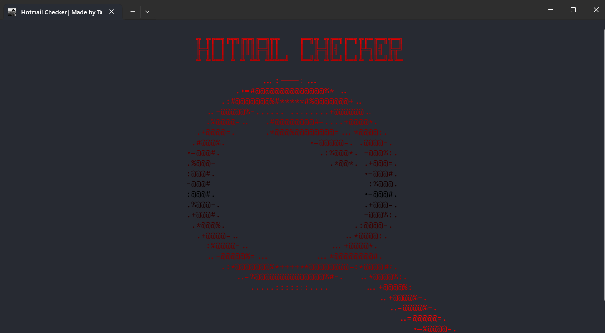
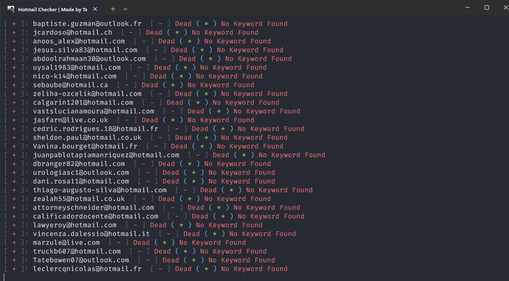
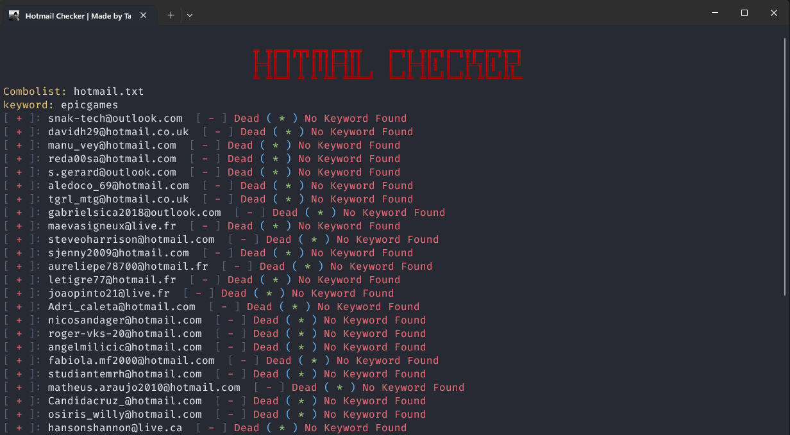
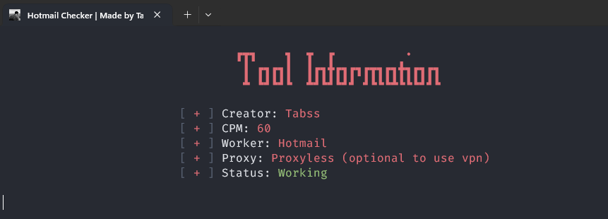

 

<h1 align="center">PYTHON HOTMAIL CHECKER</h1>

<p align="center">
   <a href="https://t.me/tabssdll">Telegram</a> ・ <a href="https://e-z.bio/tabss">Bio</a> ・ <a href="https://discord.com/users/1160553696048975905">Discord</a>
</p>

<p align="center">
  
  
  
  
</p>

<p>
  
  - Developed in <strong>Python</strong>, by <a href="https://e-z.bio/tabss">Tabss</a><br>
  - Tool in <strong>English</strong>.<br>
  - Available on <strong>Windows</strong>.<br>
  - <strong>No malware</strong> or <strong>backdoor</strong>.<br>
  - <strong>Open Source</strong> only for verification, ensuring no malicious programs.<br>
  - <strong>Frequently updated</strong>.<br>
  - <strong>Free</strong> for everyone.<br>
  - The tools include: <strong>Scanning, Osint, checker, high cpm, proxyless checker and keyword filter</strong>, And more..
  <br><br>
</p>

<h1 align="center">Tool Showcase</h1>

<p align="center">
   
   
   
  
  <br><br>
</p>

<h1 align="center">Features</h1>
<p>
   
```
┌── 💰 - Paid Version
│   ├── 200 CPM
│   ├── Backup Files
│   ├── More Mails Checker
│   ├── Telegram logs
│   └── To buy go DM to my discord or telegram
│
├── 💎 - Free Version
│   ├── 60 CPM
│   ├── Backup Files to txt
│   ├── Only Hotmail Checker
│   └── Safe and proxyless work
│
├── 🕵️‍♂️ - Hotmail Scanner
│   ├── Account check (Working or Not)
│   ├── Keyword Filter
│   └── Say if the combo have any account working
│
├── 🔎 - Osint
│   ├── Information of the account (Paid Version)
│   ├── Dox Tracker (Paid Version)
│   ├── Username Tracker (Paid Version)
│   ├── Email Tracker (Paid Version)
│   ├── Email Lookup (Paid Version)
│   ├── Phone Number Lookup (Paid Version)
│   └── Devices Lookup (Paid Version)
```
<br><br>
</p>

<h1 align="center">Requirements</h1>

<h3>Windows:</h3>

<p>
- Install <a href="https://www.python.org/downloads/">Python</a> with the <a href="Img/Python_Path.png">PATH</a> options.<br>
- Windows 10 & 11 or +
</p>

<h3>Install the requirements.txt</h3>

<p>
- Latest version of <a href="https://www.python.org/downloads/">Python</a>.<br>
- Lastest recent tool version.
<br><br>
</p>

<h1 align="center">Installation</h1>

<p>
  
```
1 - Download the .zip folder.
2 - Unzip the folder.
3 - pip install -r requirements.txt
4 - Run the py file: "python hotmail.py"
5 - Enjoy
```
<br><br>
</p>

<h1 align="center">Disclaimer</h1>

<p>
  
  - Hotmail Checker has been developed solely for educational purposes.<br>
  - This project has been created with good intentions and is intended for personal use only.<br>
  - By choosing to use our tool, you acknowledge and accept full responsibility for any consequences that may result from your actions.<br>
  - Tool is safety of malware/spyware or anything else, is free source you can check it and run it by .
<br><br>
</p>

<h1 align="center">Paid Version</h1>

<p>
  
  <strong>Contact Via Discord:</strong>
  ``` 
saint.tabss
  ```
  <strong>Contact Via Telegram:</strong>
  ```
@tabssdll
  ```

</p>
